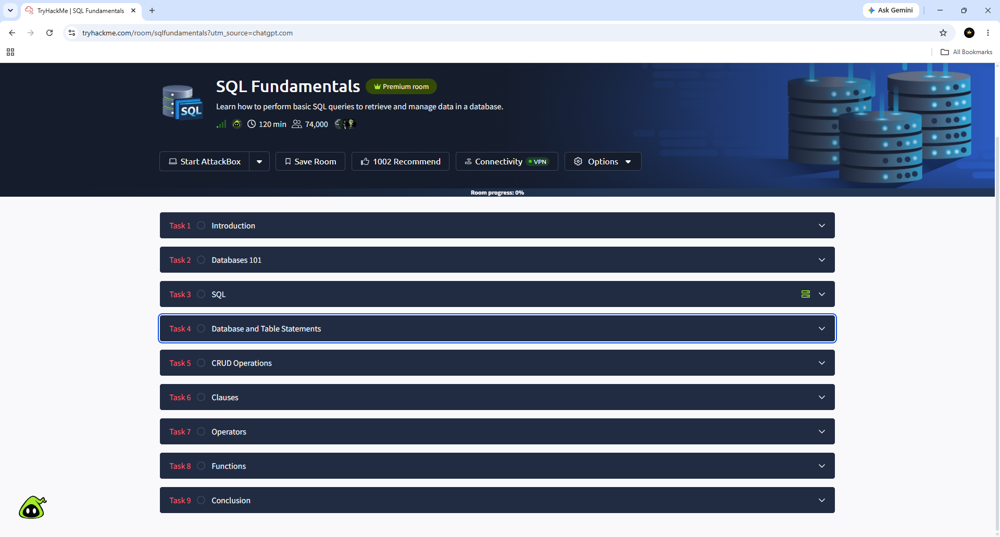
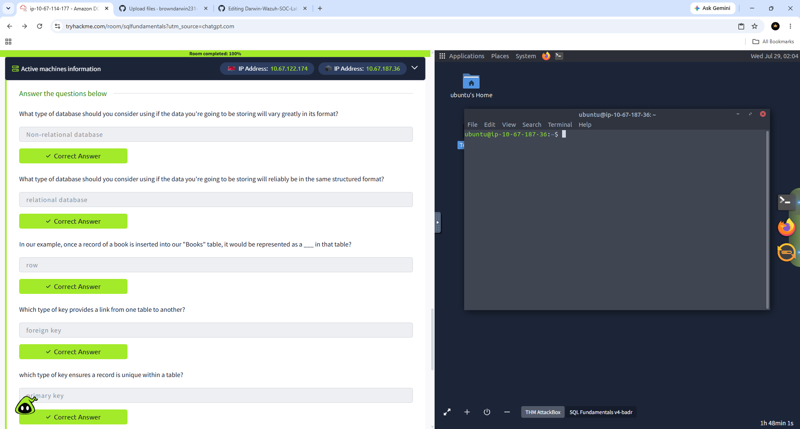
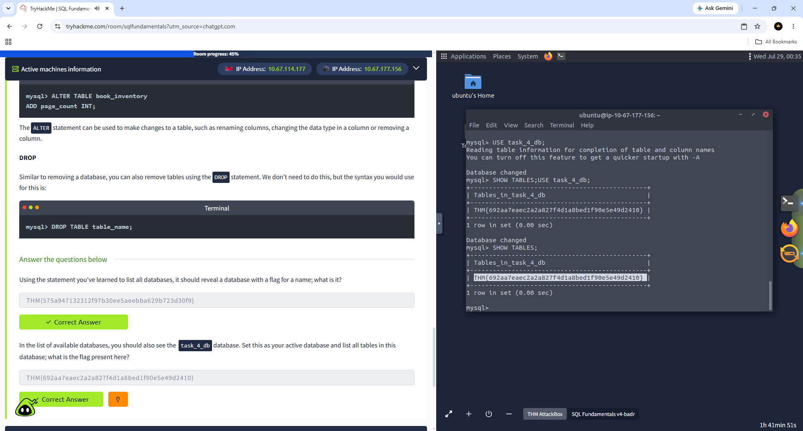
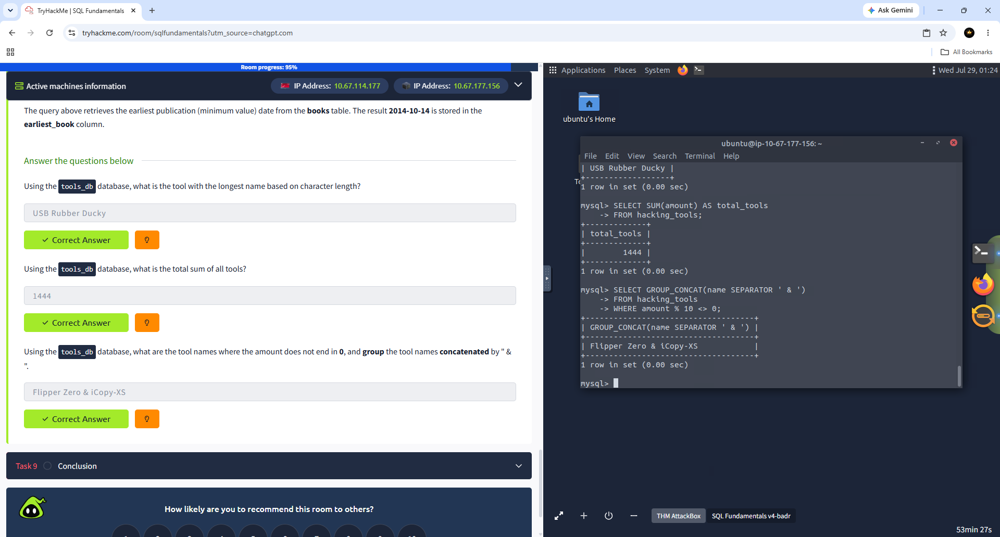
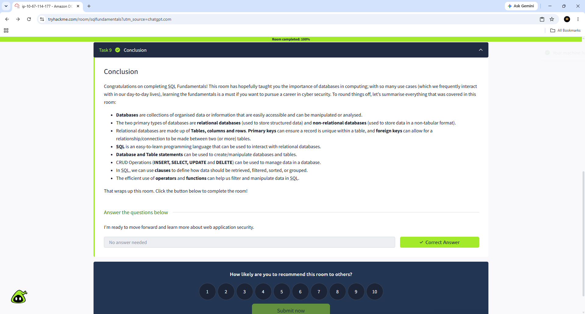

# Darwin-SQL-Fundamentals-TryHackMe
 
 This repository documents my completion of the **TryHackMe SQL Fundamentals** room.  The lab introduced the core concepts of SQL and relational databases while providing hands-on practice using MySQL. Throughout the exercises I created and modified databases, queried information, filtered data, and used SQL functions to analyze records.

---

## Skills Learned

- SQL Fundamentals
- MySQL
- Relational Databases
- Database Management
- CRUD Operations
- SELECT Statements
- INSERT Statements
- UPDATE Statements
- DELETE Statements
- Database & Table Creation
- Primary Keys
- Data Types
- WHERE Clause
- LIKE Operator
- ORDER BY
- GROUP BY
- HAVING
- DISTINCT
- Aggregate Functions
- COUNT()
- SUM()
- MIN()
- MAX()
- AVG()
- LENGTH()
- CONCAT()
- GROUP_CONCAT()

---

## Tools Used

- TryHackMe
- MySQL
- Linux Terminal
- AttackBox

---

## Screenshots

### 1. Room Overview

### 2. Virtual Environment

### 3. Database 101

### 4. Database Task

### 5. Database Task Completed

### 6. CRUD Operations

### 7. SQL Clauses

### 8. SQL Operators

### 9. SQL Functions Challenge

### 10. Room Completed (100%)

---

## Key Takeaways

During this room I gained hands-on experience with:

- Creating databases and tables
- Defining data types and primary keys
- Using CRUD operations
- Filtering data with SQL clauses
- Working with logical operators
- Sorting and grouping data
- Using aggregate functions
- Performing real-world database queries
- Writing efficient SQL statements

These skills are directly applicable to cybersecurity, SOC analysis, threat hunting, log analysis, and database investigations.

---

## Platform

TryHackMe

Room:
SQL Fundamentals

Status:

**Completed**

Author: Darwin Brown JR.
Aspiring SOC Tier 1
